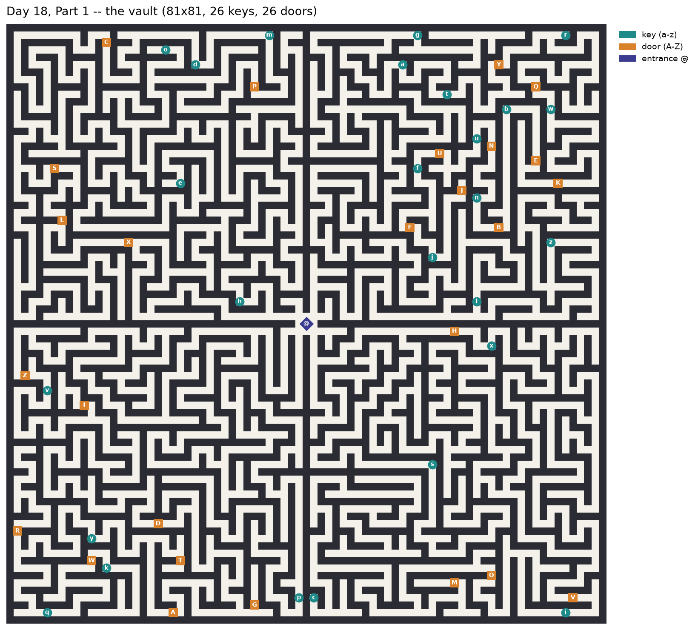
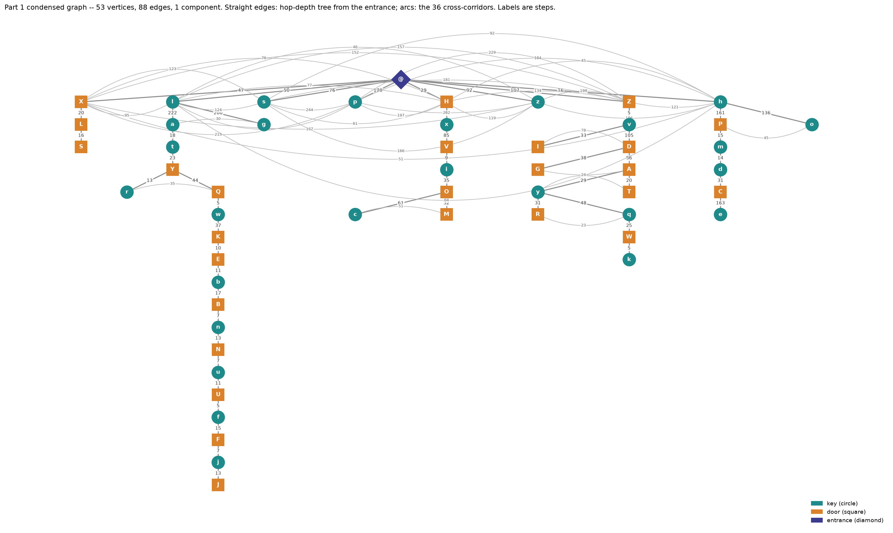
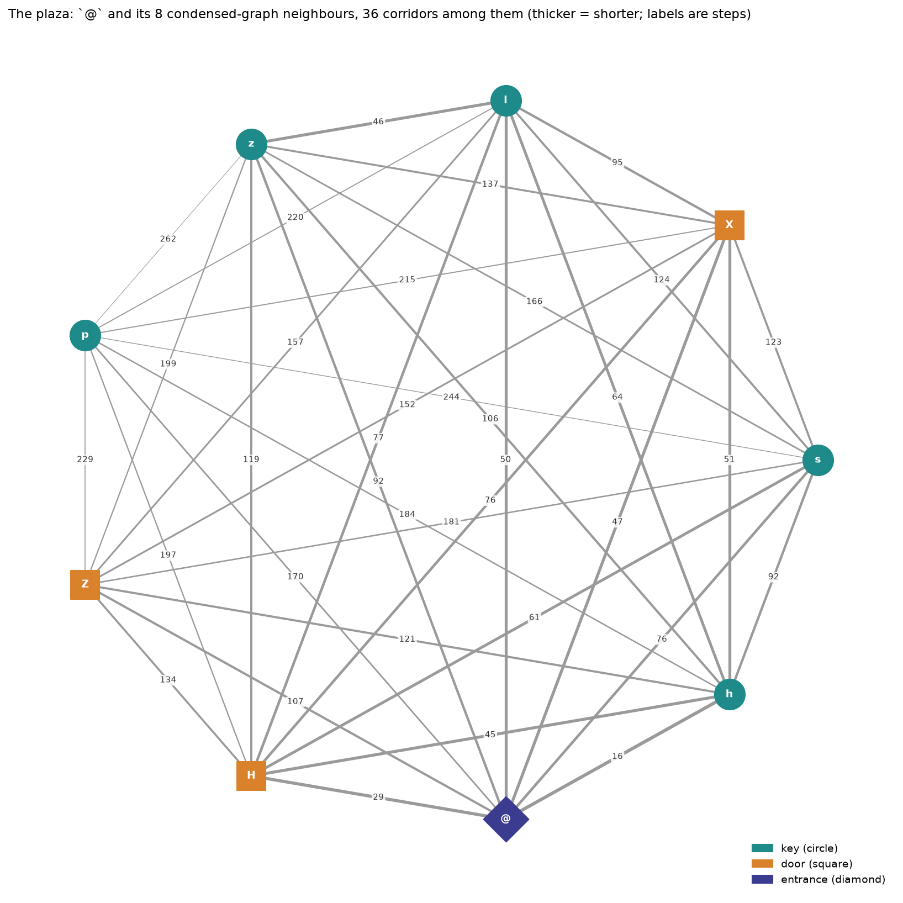
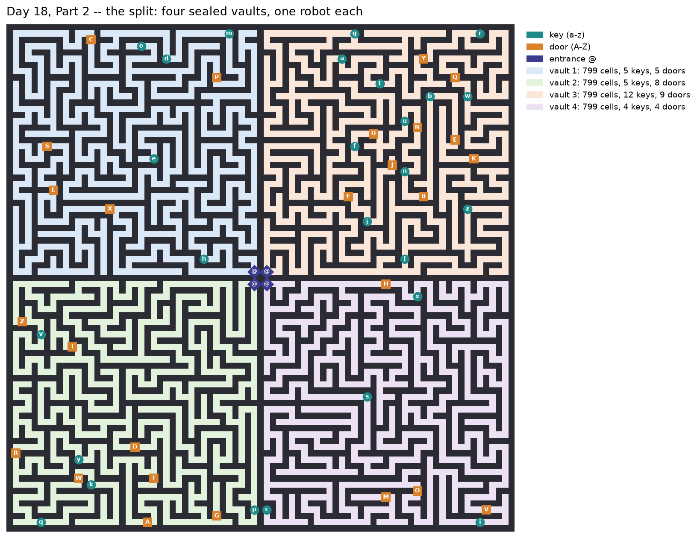
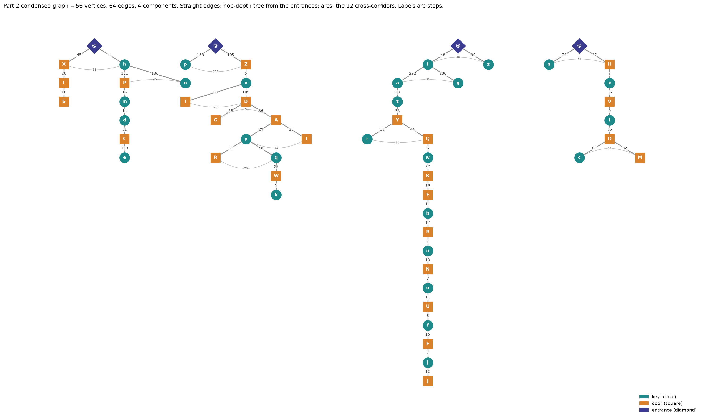

# Day 18 — Many-Worlds Interpretation (function guide)

> The first day since [Day 15](day15_function_guide.md) with a maze, and the
> first all year with a genuine **state-space search**: the answer is not a
> shortest path *through the map*, it is a shortest path through the product
> of the map with the subset lattice of keys — position × 2^26. Once you see
> that, the whole day is one Dijkstra; everything else is keeping the product
> small. The trap worth a guide entry is the popular condensation shortcut
> that silently assumes the maze is a tree — this input has **4 cycles**, the
> shortcut *happens* to survive them, and the tests here carry the map where
> it dies. Real input: **5450** and **2020**.

## The puzzle in one paragraph

An 81×81 maze holds one entrance `@`, 26 keys `a`–`z` and 26 doors `A`–`Z`.
A door is a wall until the same-letter key has been picked up; stepping on a
key picks it up. **Part 1:** fewest steps from `@` that collect all 26 keys.
**Part 2:** the 3×3 around the entrance is rewritten into four sealed vaults
with one robot in each (`@#@` / `###` / `@#@`); only one robot moves at a
time, and the answer is the fewest *total* steps for the four of them to
collect all 26 keys. Real input: answers **5450** and **2020** — Part 2 is
*smaller*, because four robots start pre-positioned where one robot had to
trek back and forth.

Code: [python/day18.py](../../python/day18.py). Tests:
[python/tests/test_day18.py](../../python/tests/test_day18.py).

---

## The shape of the day: shortest path in a product graph

Every earlier maze day ([Day 15](day15_function_guide.md)) had states that
were *places*: BFS over cells, done. Here a place does not determine what you
can do next — standing at the same junction with and without key `f` are
different situations. So the state is the pair

```
(where the robots stand, which keys are held)
```

and the search space is the **product** of the map with the powerset 2^26,
keys held encoded as a bitmask (`a` = bit 0). Edges either move within a mask
layer (plain walking) or cross into the next layer (stepping on a new key —
the mask can only grow, so the layers form a DAG even though each layer is
full of cycles). Step costs are uniform on the grid but become weighted after
condensation, so the search is **Dijkstra**, not BFS.

Named properly, the underlying problem is the **sequential ordering problem**
— asymmetric TSP with precedence constraints ("visit all keys; key behind
door X after key x") — which is NP-hard in general. The bitmask-over-subsets
Dijkstra is the same move as **Held–Karp**: exponential in keys, polynomial
in everything else, and 2^26 states is only the *ceiling* — the precedence
structure means the search visits a vanishing fraction of it (measured below:
**4,972** states for Part 1, **5,625** for Part 2, against a ceiling in the
billions).

Three reductions make the product searchable, and each is an identity with a
test pinning it:

1. **Condense the grid to the 53 cells that matter** (entrance + 26 keys +
   26 doors), corridors becoming edge weights.
2. **Doors stay vertices** of the condensed graph — the exactness condition
   the popular shortcut violates.
3. **Move in whole strides** — "go collect key k" — cutting each stride at
   the first uncollected key it touches.

## Condensation: 3,201 cells become 53 vertices

`condense` runs one BFS per entrance/key/door cell, expanding through plain
floor but **stopping at any other such cell**: an edge `(v, d)` means "d
steps of corridor with nothing of interest in between". A grid walk that
passes through a door or key decomposes into graph edges exactly at the cells
where the rules could have something to say, so condensation loses geometry
but never routes. Measured on the real input: 3,201 open cells collapse to
**53 vertices and ~88 undirected edges** (176 directed), the longest corridor
between two points of interest running **262 steps**.

### Pictures: the maze and the graph it condenses to

Rendered by [python/viz_day18.py](../../python/viz_day18.py) (networkx +
matplotlib, Graphviz `dot` for the layouts) from the real input. Keys are
teal circles, doors orange squares, entrances indigo diamonds; every node
carries its letter, so colour is never the only cue.



The 81×81 grid: four quadrants of corridor meeting at the open 3×3 around
`@`. Every figure in this section was measured in the session that drew
it; the structural claims are pinned by `test_real_maze_is_not_a_tree` and
`test_real_cycles_all_sit_in_the_entrance_3x3`.



The 53-vertex, 88-edge condensed graph. The layout is Graphviz `dot` run on
the **hop-depth spanning tree** from `@` (straight edges, one rank per point
of interest deep); the other 36 edges are drawn as arcs. Two things jump
out that the grid picture hides:

* **Four long chains** hang off the centre. The deepest,
  `Q w K E b B n N u U f F j J`, is a forced 14-deep sequence, and the
  chains are where the precedence constraints live. Eight chords sit
  outside the centre -- `a-g`, `r-Q`, `I-D`, `G-A`, `y-T`, `R-q`, `c-M`,
  `P-o` -- each closing a small triangle.
* **The centre is a plaza.** `@` and its 8 condensed neighbours
  (`h H Z z p s l X`) are pairwise adjacent: 36 edges on 9 vertices, a
  complete **K9**. 28 of those are non-tree edges, which with the 8 chords
  accounts for all 36 arcs.

The plaza looks like evidence of an open, cyclic middle. It is not, and the
distinction matters for the shortcut discussion below. **Condensation turns
a door-free junction into a clique**: if k points of interest hang off a
junction region that contains no other point of interest, every pair sees
the other with nothing in between, and the condensed graph gets K_k -- on a
*tree*. So the condensed graph's cycle rank (88 − 53 + 1 = 36) says nothing
about grid cycles. The grid has exactly 4, and a minimum cycle basis puts
all four **inside the entrance's 3×3**: they are its four 2×2 blocks.
Delete the 3×3 and the 3,192 remaining cells form a forest (3,184 edges, 8
pieces -- each vault touches the block at two cells). That is why the
doors-as-annotations shortcut survives this input: the only cycles hold no
doors, so there is never a detour a door annotation could miss. It is
luck, not a guarantee.



The plaza on its own, thicker = shorter. Part 2 walls off the centre of
this: the rewrite deletes `@` and the 3×3's cross, and with it every grid
cycle.





After the split: **56 vertices, 64 edges, 4 components**, 12 arcs, and no
hub -- each vault is a literal grid tree (3,196 cells, 3,192 edges, 4
components; pinned by the same test). The vaults are equal in floor area
(799 cells each) but unequal in work: keys/doors per vault, from the
legend, are **5/5** (top-left), **5/8** (bottom-left), **12/9**
(top-right) and **4/4** (bottom-right). The top-right robot owns the
14-deep chain; its doors `K E B N U F J` are mostly keyed from inside that
vault (`b n u f j` live there), but `k` is bottom-left's and `e` is
top-left's, and the chain cannot get past `K` until the bottom-left robot
has walked `Z`, `D`, `A` and `W` to reach `k`. That is what
`test_part2_where_one_vault_must_wait_out_a_chain` models in miniature,
and why the mask-localised cache under `min_steps` earns its keep: three
robots' progress churns the full mask while the fourth's reachable set has
not changed.

### Why doors must be vertices, not annotations

The shortcut most write-ups reach for: BFS key-to-key, record the distance
*and the doors seen along that one shortest path*, then search over keys
only. That records the doors on *a* path, not the requirement for *reaching
the key* — if a longer detour avoids a locked door, the annotation forgets
it. On a tree there is only one simple path between any two cells and the
shortcut is exact. On a maze with cycles it can be wrong.

This input **has cycles**: 3,201 open cells, 3,204 corridor adjacencies, one
connected component — a spanning tree would use 3,200 edges, so there are
exactly **4 independent cycles** (`test_real_maze_is_not_a_tree`; contrast
[Day 15](day15_function_guide.md), whose maze measured out as a perfect
tree). Measured, the shortcut *happens* to survive them — an
annotation-style solver reproduces both 5450 and 2020 on this input — but
nothing in the statement promises that, and the test module carries the map
where it dies:

```
###########
#@.A.b...a#
#.#######.#
#.........#
###########
```

Every key's geodesic from `@` crosses door `A` (b in 4 steps, a in 8), so
the annotation solver believes both keys are locked at step zero and
**deadlocks**. The detour down and around reaches `a` in 12 steps, then `b`
four more: **16**, which `part1` and the raw-grid oracle both return
(`test_detour_around_a_locked_door`). With doors as vertices the detour
survives condensation because a locked door only blocks the *vertex*, never
the alternative edges around it.

## Strides: cut at the first uncollected key

Within a fixed mask, walking is ordinary Dijkstra on the condensed graph. So
the outer search moves in strides — "robot i goes and collects key k" — and
`reachable_keys` enumerates the candidate strides: an inner Dijkstra from the
robot's vertex that refuses locked door vertices and **stops at each
uncollected key** (records it, does not search past it).

Cutting there is lossless, by a WLOG argument in two halves:

* **Collecting is free and monotone.** Picking up a key costs zero steps and
  only ever opens doors — holding more keys never closes a route. So any
  optimal walk can be assumed to collect every key it steps on.
* Given that, look at any optimal walk and cut it at the **first**
  uncollected key it touches. The prefix is a walk under a constant mask,
  ending the moment a new key is taken — precisely a stride. Induction on
  the suffix decomposes the whole walk into strides.

Neither half is left as prose: the test module's `oracle` is a brute-force
BFS over `(positions, mask)` states **on the raw grid** — a transcription of
the rules with no condensation and no strides — and `min_steps` must agree
with it on every map small enough to grind: four of the five statement
examples (the 16-key one would cost the oracle ~2^16 masks) and the
four-vault Part 2 maps.

## Part 2: map surgery, not a new algorithm

`split_entrance` rewrites the 3×3 around `@`:

```
...        @#@
.@.   →    ###
...        @#@
```

and returns a `Vault` with four entrances; `min_steps` is oblivious — the
positions tuple simply has four slots now. Two modelling notes:

* **"Only one robot moves at a time" costs nothing.** Steps add, and no rule
  couples the robots except the shared mask, so any interleaving of the four
  robots' walks has the same total; the state graph never needs to know
  whose turn it is. (`test_part2_where_one_vault_must_wait_out_a_chain`
  pins this on a map whose pickup order is completely forced across three
  vaults.)
* **A robot with nothing to do simply has no strides.** When its next door
  is keyed from another vault, `reachable_keys` returns `{}` for it until
  the shared mask catches up — "waiting" needs no representation.

The rewrite's precondition — a fully open, letter-free 3×3 around a single
entrance — is a property of the input, not a promise of the statement, so
`split_entrance` checks it and refuses rather than silently deleting a key
that happened to sit next to `@` (same stance as
[Day 16](day16_function_guide.md)'s offset-past-the-midpoint check). The
real input obliges: `@` sits dead centre at (40, 40) with all eight
neighbours open (`test_real_map_shape`).

The four vaults are wildly uneven — measured by flooding the condensed graph
from each corner entrance:

| vault (x, y) | keys | doors |
|---|---|---|
| (39, 39) | `dehmo` | `CLPSX` |
| (41, 39) | `abfgjlnrtuwz` (12 of 26!) | `BEFJKNQUY` |
| (39, 41) | `kpqvy` | `ADGIRTWZ` |
| (41, 41) | `cisx` | `HMOV` |

Every vault's doors are keyed almost entirely from *other* vaults, which is
what makes Part 2 a genuine coordination problem rather than four
independent Part 1s.

### Why Part 2 is *faster* than Part 1

Counter-intuitive but measured: Part 1 takes ~103 ms, Part 2 ~42 ms, despite
the state having four position slots. Two effects compound:

* **The answer is shorter** (2020 vs 5450) — four pre-positioned robots
  never trek across the map — so Dijkstra's frontier stays shallower.
* **Masks localise.** Each robot's strides depend only on the keys and
  doors in *its own vault*, and the cache below exploits exactly that.

## The Day 18 code, form by form

### `Vault` and `parse_input`

The full parse, per the repo rule: every non-wall cell classified into
`open_cells` / `keys` / `doors` / `entrances`, positions as `(x, y)`. Doors
map to the **lowercase** letter of the key that opens them — the case
distinction is spelling, not information, and lowering it at parse time
means nothing downstream compares cases. Door and key cells are also in
`open_cells`: they are floor you can stand on; walls are the only cells
missing. `splitlines()` is the CRLF guard — it treats `\r\n` as one break,
so a Windows-downloaded input parses identically to a Unix one; without it a
stray `\r` would become a phantom open cell hanging off every row's end.

### `all_keys_mask`

The goal mask, built from the keys **present in the map**, not from the
doors — a door whose key does not exist is merely a wall forever, it does
not extend the goal. On the small examples this matters (several have doors
with no matching key); on the real input all 26 of each exist.

### `split_entrance`

The Part 2 surgery, above. Refuses a cramped or lettered 3×3.

### `condense`

One BFS per point of interest, stopping at the others. Parallel corridors
between the same pair of vertices become parallel edges; Dijkstra simply
never prefers the longer one, so no dedup is needed.

### `min_steps` and `reachable_keys`

The outer Dijkstra over `(positions, mask)`, strides supplied by the inner
Dijkstra. One genuine optimisation ships in the source rather than the
sidebar, because it is three lines and doubles Part 2: the stride cache's
key is the mask **reduced to the bits that can matter from that source** —
the keys and doors in the source's connected component (`relevant`, one
flood per vertex with locks ignored). In Part 2 a robot's component is its
own vault, so the other three robots' collecting — which churns the full
mask constantly — stops invalidating its cache entries. Measured on the real
input: Part 2 makes **22,176** stride queries that collapse to **465**
distinct inner searches with the reduction, against **7,486** without it —
40.6 ms vs 75.3 ms end to end. (Part 1 gets nothing from it: one component,
every bit relevant, and indeed 4,919 queries stay 4,919 searches.)

Search-size numbers for calibration, measured on the real input:

| | states reached | heap pops | inner searches |
|---|---|---|---|
| Part 1 | 4,972 | 8,037 | 4,919 |
| Part 2 | 5,625 | 6,566 | 465 |

### `part1`, `part2`, `solve`, `main`

`part1` is `min_steps` on the parsed vault; `part2` is `min_steps` on the
split vault. Nothing else differs — the day's two halves share every line of
search code.

## Possible optimization: sort the heap by keys remaining

Untested pseudo-Python, per the sidebar policy. The classic accelerant for
this day is turning Dijkstra into **A\***: any admissible lower bound on the
steps still needed prunes the frontier. The cheap bound is the largest
distance from any robot to any key it still owes; a stronger one sums, per
vault, the farthest uncollected key from that vault's robot:

```python
def heuristic(positions, mask):
    return max((dist[p][k] for p in positions for k in keys_missing(mask)
                if k in dist[p]), default=0)

heapq.heappush(heap, (g + heuristic(*state), g, *state))
```

with `dist` the all-pairs distances over the condensed graph ignoring locks
(locks only make true costs *larger*, so ignoring them keeps the bound
admissible). At 145 ms total this input does not need it, so it stays a
sidebar; it is the move to reach for on the pathological inputs where the
plain product search grows into seconds.

## Tests (what is pinned and why)

28 tests. The statement's five Part One examples (8 / 86 / 132 / 136 / 81)
and four Part Two examples (8 / 24 / 32 / 72) run as written — the Part Two
maps arrive pre-split, four `@`s already in place, so they go through
`min_steps` directly, except the first, whose unsplit form exercises the
whole `part2` pipeline including the rewrite. Beyond those, the module pins
the claims the solver's structure rests on:

* **`oracle`** — brute-force BFS over `(positions, mask)` on the raw grid,
  sharing no assumption with the code under test — must agree with
  `min_steps` on every map small enough to grind: four of the five Part One
  examples (the 16-key one would cost ~2^16 masks), the two smallest Part
  Two examples, and the forced-chain map. This is the check on condensation
  *and* on stride-cutting at once.
* **`test_detour_around_a_locked_door`** — the cycle map where the
  doors-as-annotations shortcut deadlocks; `part1` and the oracle both
  return 16.
* **`test_real_maze_is_not_a_tree`** — 3,201 cells, 3,204 adjacencies: the
  cycles that make the previous test more than hypothetical.
* **`test_real_cycles_all_sit_in_the_entrance_3x3`** — and where they are:
  delete the open 3×3 and the rest is a forest; the Part 2 split map is
  four trees. This is the measured reason the annotation shortcut *happens*
  to work here, and the reason Part 2's vaults have no cycles at all.
* **`test_split_entrance_geometry`** and the two refusal tests — the Part 2
  rewrite touches exactly five cells, and refuses a cramped or lettered 3×3
  rather than corrupting the map.
* **`test_part2_where_one_vault_must_wait_out_a_chain`** — a forced pickup
  order across three vaults; interleaving must cost nothing.
* CRLF constructed (`EX1` with `\r\n`) and against the real file, per the
  repo's standing Windows rule; `test_real_map_shape` (81×81, 26+26 letters,
  entrance at (40, 40) with the open 3×3 Part 2 needs);
  `test_no_keys_means_no_steps`; `test_unreachable_key_raises`;
  `check_locked` against `LOCKED = (5450, 2020)`, both verified on
  adventofcode.com.

## Benchmarks

```
best / median ms over 7 repetitions

day                parse               part 1               part 2      total
-----------------------------------------------------------------------------
 18      0.578     0.599    102.720   149.358     41.719    45.332    145.016
```

A mid-pack day: an order of magnitude slower than the pure-arithmetic days,
an order faster than [Day 16](day16_function_guide.md)'s 2 s. The cost is
almost entirely the ~5,000-state outer Dijkstra re-running inner Dijkstras;
the grid work (`condense`, 53 BFS sweeps over 3,201 cells) is a one-time
5.5 ms (best of 7, measured separately). Part 2 beating Part 1 by 2.5× is the mask-localisation story told
above, not noise — the spread between best and median on Part 1 is the OS,
the gap between the parts is structure.

## If I were writing this in Rust

The state `(positions, mask)` is where Rust gets pushy about representation.
Python hashes a tuple of tuples; Rust would pack the whole state into a
single `u64` — 26 bits of mask, four 6-bit vertex ids (53 vertices fit
easily), zero allocation, `FxHashMap<u64, u32>` for distances — and the
condensed graph becomes a `Vec<Vec<(u8, u32)>>` indexed by vertex id instead
of a hash map keyed by coordinates. The inner Dijkstra's `best` map becomes
a flat `[u32; 54]` reset per call. `BinaryHeap<Reverse<(u32, u64)>>` and the
whole search is arena-free and branch-predictable; 145 ms would plausibly
drop under 5. The deeper point is the same one every AoC-in-Rust port
teaches: Python's dict-of-tuples habit is *fine* until the keys are hot, and
here they are hot — every heap pop hashes a nested tuple. Rust makes the
bit-packing explicit; in Python it would be an obfuscation for a 3× that the
day does not need.

## What's next

Day 19 returns to Intcode (the tractor beam this vault's statement jokes
about). The state-space-product lens recurs in 2019: Day 20 (recursive
mazes — position × depth) and Day 24 (recursive Game of Life) both play the
same trick of multiplying a map by a hidden dimension.
