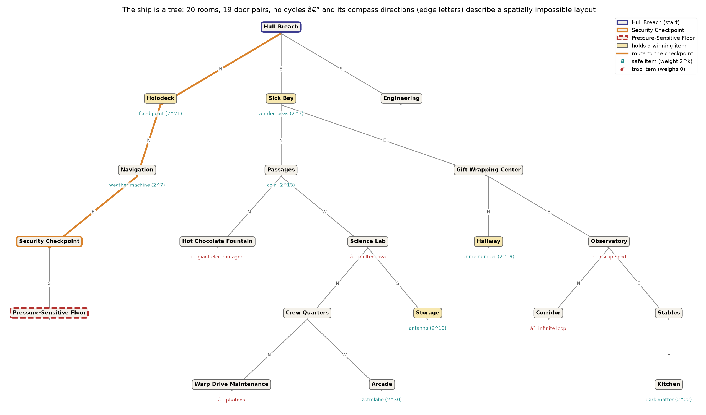

# Day 25 — Cryostasis (function guide)

> Source: [python/day25.py](../../python/day25.py) ·
> Tests: [python/tests/test_day25.py](../../python/tests/test_day25.py) ·
> Statement: [day25.md](day25.md) ·
> Engine internals: [day25_disassembly.md](day25_disassembly.md)

## The puzzle in one paragraph

The input is a text adventure: the Intcode machine (frozen since
[Day 9](day09_function_guide.md)) prints room descriptions through opcode 4
and reads typed commands through opcode 3, one ASCII code at a time. A droid
walks Santa's ship — twenty rooms, thirteen items, five of them traps — and
a pressure-sensitive floor guards the cockpit: step on it carrying the wrong
total weight and a voice ejects you back to the checkpoint, saying only
*heavier* or *lighter*. Carry exactly the right subset of items and the
voice reads out the airlock password. That password is part 1; there is no
part 2 — the fiftieth star is granted for having the other forty-nine, so
`part2` returns `None` by contract.

## The peripheral saga ends

Every Intcode day since the VM froze has been the same machine wearing a
different peripheral on opcodes 3/4. Day 25 closes the arc with the most
honest peripheral of all:

| day | peripheral | protocol |
|---|---|---|
| [11](day11_function_guide.md) | painting robot | color/turn pairs |
| [13](day13_function_guide.md) | arcade cabinet | joystick in, tiles out |
| [15](day15_function_guide.md) | repair droid | move codes, status codes |
| [17](day17_function_guide.md) | camera + vacuum robot | ASCII frames, ASCII program |
| [19](day19_function_guide.md) | tractor-beam probe | coordinates in, bit out |
| [21](day21_function_guide.md) | springdroid | a program *in another language* |
| [23](day23_function_guide.md) | network of fifty VMs | packet triples |
| **25** | **a human at a keyboard** | **a text adventure** |

The intended experience is to play it by hand. The solution replaces the
human with three classical pieces:

1. **Exploration** — depth-first search over an unknown graph, walking each
   door forward and back as the recursion unwinds (Trémaux's maze strategy,
   the same discipline as [Day 15](day15_function_guide.md)'s backtracking
   explorer, minus the coordinates: rooms here are names, not points).
2. **Safety probing** — five items are lethal to pick up. Instead of a
   hardcoded blacklist, every `take` is first tried in a **forked copy of
   the VM** and judged by what happens: speculative execution with
   rollback.
3. **Subset search** — the floor is a SUBSET-SUM oracle. Eight safe items
   means 256 candidate load-outs, walked in **reflected Gray code** order
   so consecutive trials differ by a single take-or-drop.

## The ship, drawn



Drawn by [python/viz_day25.py](../../python/viz_day25.py) from the static
engine recovery — the game is never run. Two map facts, both pinned by
`test_ship_is_a_tree_with_impossible_geometry`, decide how it is drawn:

- **The ship is a tree.** Twenty rooms, nineteen door pairs, no cycles —
  the DFS's visited-set never actually earned its keep, and every room has
  exactly one path to the checkpoint.
- **The geometry is impossible.** Lay rooms out by their own compass doors
  (north = one cell up, and every door *is* faithfully reciprocated) and
  five pairs of distinct rooms land on the same grid cell. The classic
  text-adventure non-Euclidean shrug — so the figure keeps the directions
  as edge letters and draws the topology honestly as a tree instead of
  pretending a deck plan exists.

Gold rooms hold the four winning items; teal item tags are safe (each with
its power-of-two weight — see below), red ones are the five traps; the
orange spine is the three-move route the droid walks to the checkpoint once
loaded.

## The Day 25 code, form by form

### `Droid(VM)` — `run`, `send`, `fork`

The ASCII layer over the frozen VM, and nothing else: `run()` steps until
the machine blocks on input or halts, decoding every opcode-4 byte;
`send(command)` queues `command + "\n"` and runs. Both take an optional step
`budget` and return `None` when it expires — that None **is** the probe's
hang verdict, not an error. `fork()` copies memory, `ip`, `rb` and the input
queue: an independent parallel universe for one dict-copy (~5k entries).
This is [Day 7](day07_function_guide.md)'s block/resume protocol doing its
finale: because `step()` reports "blocked" without consuming anything, the
caller can compute the next command *from the text it just read*.

### `parse_room(text) -> Room | None`

A `(name, doors, items)` NamedTuple scraped from `== Name ==` headers and
the two `- ` bullet lists. One deliberate rule: **the last block wins**.
Stepping onto the pressure floor with the wrong weight prints *two* rooms —
the floor's own description, the alert, then the checkpoint re-described as
the droid is thrown back — and the droid is standing in the second one.
Pinned by `test_parse_room_keeps_the_last_block`.

### `take_is_survivable(droid, item, door) -> bool`

The sandbox. Fork, `take` the item, then try to walk through a door; the
item is condemned if the machine **halts** (molten lava melts you, photons
feed you to a grue, the escape pod launches you into space), **never
answers** within `PROBE_BUDGET = 100_000` steps (the `infinite loop` item is
exactly what its name says — see the disassembly guide for the joke in its
code), or **answers without a room header** (the giant electromagnet leaves
the machine alive but refuses every movement). Three checks, five traps,
zero item names in the code. The budget's two-sided adequacy — small enough
to convict silence, large enough that a legitimate reply never trips it —
is pinned by the fixture games in `test_probe_verdicts`.

### `Survey` / `explore(droid) -> Survey`

Recursive DFS from the starting room. Per room: probe and pocket every
survivable item, then walk each door; a move that lands the droid back in
the room it left is the pressure floor's ejection, which conveniently marks
both the checkpoint (`survey.checkpoint_path` — the DFS trail at that
moment) and the door onto the floor (`survey.test_door`). Every other door
is recursed through and then unwound with its opposite. Terminates because
rooms are descended into only on first sight; ends with the droid back at
the start carrying all eight safe items.

### `crack_floor(droid, survey) -> str`

Walk to the checkpoint, then try load-outs. Trial *i* carries
`full_set XOR gray(i)`: flipping the lowest set bit of *i* — `(i & -i)
.bit_length() - 1` — walks the complemented reflected Gray code, so every
failed trial costs exactly one `take`/`drop` plus one step onto the floor,
and 2ⁿ trials provably visit all 2ⁿ subsets
(`test_gray_walk_covers_every_subset_one_toggle_apart` pins the coverage as
arithmetic). Returns the airlock speech the moment a reply carries no
`Alert!`.

### `part1` / `part2` / `solve`

`part1` = explore, crack, then extract the one number: the speech's
password, matched by `typing (\d+) on the keypad` — and the disassembly
shows the password is the *only* number the game can print (the engine's
sole numeric-output routine is called from the victory path alone). `part2`
returns `None`: no puzzle exists. `solve` returns `(password, None)`.

## The real input, measured

All by `python/day25.py` instrumented (see the suite and the disassembly
tool for the cross-checks):

| phase | wall | VM steps | commands |
|---|---|---|---|
| explore (19 rooms, 13 probes, 8 takes) | 0.42 s | 460,229 | 103 |
| crack (237 floor trials) | 2.75 s | 3,013,339 | 476 |
| **whole solve** (instrumented; bench row below is the clean 2.86 s) | **~3.2 s** | **3,473,568** | **579** |

~1.1 M `step()` calls per second — [Day 15](day15_function_guide.md)'s
interpreter cost model holding steady through the eighth and final Intcode
day. The game prints 119,622 characters of ASCII over the run, about a
character per 29 VM steps. The winning load-out {fixed point, prime number,
antenna, whirled peas} arrives at trial **236 of 256** with this
exploration's collection order — Gray code guarantees coverage, not luck.

## The problem within the problem

The floor is a subset-sum instance, and the disassembly
([day25_disassembly.md](day25_disassembly.md)) shows it is a *planted* one:
the eight safe items weigh eight **distinct powers of two** (2³ up to 2³⁰),
so all 256 subsets weigh differently, the solution is unique, and its
members are literally the 1-bits of the target weight. The target sits in
the image as 33 cells compared against 84×52 — and the "password" the voice
reads out is nothing but **the droid's own weight**, printed back at you.
Part 1 is recoverable off the disk in ~9 ms without booting the VM
(`day25_disasm.static_password`), and
`test_static_password_matches_the_live_game` holds the two worlds together.

## Possible optimization

The shipping walk ignores half the oracle: the alert says *heavier* or
*lighter*, not just *no*. With all item weights positive, "carrying S is
too heavy" condemns every superset of S, and "too light" every subset —
monotone pruning, the same observation that powers the Apriori algorithm.
Untested sketch:

```python
candidates = all_subsets_by_size_descending
while candidates:
    s = candidates.pop()
    verdict = try_floor(s)                    # heavy | light | open
    if verdict == "open": return s
    if verdict == "heavy": candidates.discard_all(supersets_of(s))
    else:                  candidates.discard_all(subsets_of(s))
```

On random instances this prunes the 2ⁿ lattice to a fraction; on *this*
instance the deepest cut is free: the disassembly's static decode replaces
the entire search with reading 33 cells. As with
[Day 14](day14_function_guide.md)'s LP sidebar, the pruning documents the
technique; the shipping Gray walk stays because 2.8 s needs no rescue.

## Tests (what is pinned and why)

No worked example exists, so — as on Days 17, 19, 21 and
[23](day23_function_guide.md) — the logic is exercised on **hand-assembled
fixture games** (a nine-cell read-a-line loop, `104`-pairs for printing):
the probe's three verdicts each provoked on purpose, the probe's
non-interference with the real droid, last-block-wins parsing, the Gray
walk's coverage, CRLF tolerance, and `part2 is None`. On the real input:
the live sweep and the static engine agree on the map, item placement and
— item for item — the five traps; the static password equals the live one;
the weights are distinct powers of two; the five trap hooks behave in vitro
as advertised (including the electromagnet's flag locking the dispatcher);
the generated listing accounts for all 4,807 cells; and `test_real_input`
locks part 1 (`LOCKED` stays `None` until adventofcode.com accepts the
answer — the conftest discipline, hand-rolled here because `check_locked`
would nag forever about a part 2 that does not exist).

## Benchmarks

`python\bench.py 25`, best/median ms over 7 reps:

| phase | best | median |
|---|---|---|
| parse | 0.357 | 0.382 |
| part 1 | 2858.501 | 2887.966 |
| part 2 | 0.000 | 0.000 |
| **total** | **2858.858** | |

Slowest solve of the year that isn't algorithmic: the 2.9 s is pure
interpreter throughput (3.5 M steps), 87% of it spent re-answering the
floor's 237 weigh-ins. Every trial re-prints the floor's room description
before the verdict — the engine is chatty by design.

## If I were writing this in Rust

The fork is the interesting seam. Python's `dict.copy()` per probe is
`O(live cells)` and invisible at thirteen probes; a Rust VM on a
`Vec<i64>` would clone in a `memcpy` and make **probe-per-command**
affordable — fork on every send, keep the timeline that survives, a poor
man's `rr`. The Gray walk is `i.trailing_zeros()` instead of
`(i & -i).bit_length() - 1`, and `Room`/`Survey` become owned structs with
no `Option` gymnastics because `parse_room`'s "maybe a room" collapses into
`Result` at the one call site that cares. The real divergence is the text
layer: Rust would want a typed `enum Reply { Room(..), Ejected(..),
Victory(..) }` parsed once, where Python happily re-greps the same string —
and the enum version would have caught the two-blocks-per-ejection wrinkle
at the type level instead of by reading transcripts.

## What's next

Nothing — this is the last door on the ship. Days 1–25 all have Python
solutions, the eight-day Intcode arc is closed, and the machine that
restored a gravity assist on [Day 2](day02_function_guide.md) ends the year
running a Zork descendant whose password is your own weight read back to
you. The
one candidate follow-on is the post-year capstone: a single-step Intcode
debugger over the frozen VM, for which this repo now owns disassemblers,
listings, in-vitro call harnesses and five self-modifying-code case studies
as raw material.
